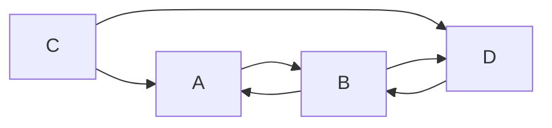
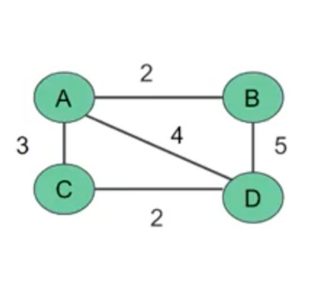
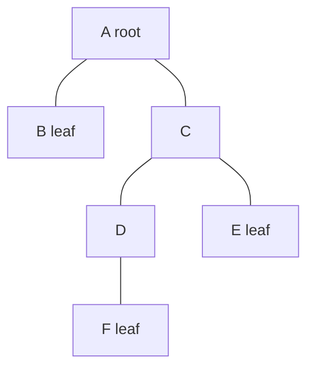
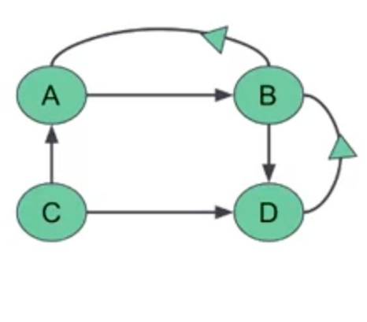

# Exam Notes

## Number Systems and Bases
- Base: The number of digits a counting system uses. For example, the decimal system has a base of 10 (digits 0-9).
- Binary: Base 2 system with digits 0 and 1, used in electronic systems.

## Place Values
- Decimal: Each place value is a power of 10. For example, in 7345, the place value of 3 is 300.
- Binary: Each place value is a power of 2. For example, in 1011, the place value of the leftmost 1 is 8.

## Conversions

- Binary to Decimal: Calculate the place value of each digit and add them.
- Decimal to Binary: Divide by 2 and track the remainders.
- Hexadecimal: Base 16 system with digits 0-9 and A-F. Compact representation for binary numbers.
- Hexadecimal to Decimal: Calculate the place value of each digit and add them.
- Decimal to Hexadecimal: Divide by 16 and track the remainders.

## Hexadecimal Colors
- Represented by a hash (#) followed by 6 hex digits (e.g., #1F256A). Convert to RGB format.

## Bit Shifting
- Right Shift: Drop the right-most digits.
- Left Shift: Add zeros to the end.

## Conversion Between Bases
Convert to decimal first, then to the target base.

## Truth Tables

### AND
| p | q | p & q |
|---|---|-------|
| T | T | T     |
| T | F | F     |
| F | T | F     |
| F | F | F     |

### OR

| p | q | p V q |
|---|---|-------|
| T | T | T     |
| T | F | T     |
| F | T | T     |
| F | F | F     |

### XOR

| p | q | p ^ q |
|---|---|-------|
| T | T | F     |
| T | F | T     |
| F | T | T     |
| F | F | F     |

### =>

| p | q | p => q |
|---|---|---------|
| T | T | T      |
| T | F | F      |
| F | T | T      |
| F | F | T      |

### <=>

| p | q | p <=> q |
|---|---|----------|
| T | T | T       |
| T | F | F     |
| F | T | F       |
| F | F | T       |

## Bitwise Operations

### Common Bitwise Operations
- AND (&): Compares each bit of two numbers and returns a new number where each bit is 1 only if both compared bits are 1.
    - Example: 5 & 3 (in binary: 0101 & 0011 = 0001 which is 1 in decimal)
- OR (|): Compares each bit of two numbers and returns a new number where each bit is 1 if at least one of the compared bits is 1.
    - Example: 5 | 3 (in binary: 0101 | 0011 = 0111 which is 7 in decimal)
- XOR (^): Compares each bit of two numbers and returns a new number where each bit is 1 if the compared bits are different.
    - Example: 5 ^ 3 (in binary: 0101 ^ 0011 = 0110 which is 6 in decimal)
- NOT (~): Flips each bit of a number, turning 1s into 0s and 0s into 1s.
    - Example: ~5 (in binary: ~0101 = 1010 which is -6 in decimal due to two’s complement representation)
- Left Shift (<<): Shifts all bits of a number to the left by a specified number of positions, adding zeros on the right.
    - Example: 5 << 1 (in binary: 0101 << 1 = 1010 which is 10 in decimal)
- Right Shift (>>): Shifts all bits of a number to the right by a specified number of positions, dropping bits on the right.
    - Example: 5 >> 1 (in binary: 0101 >> 1 = 0010 which is 2 in decimal)

## Sets

A set is a well-defined collection of distinct objects
Represented using capital letters (S, A, B, U)
The objects are called elements/members
No duplicates in sets

### Examples:
- A = {1, 10, 12, 15}
- B = {5, 99, 2, 67, 12} = {2, 5, 12, 67, 99}
- C = {} or Φ (phi - greek) or ∅ (miniscule -
Danish/Norwegian)

Universal set “U” is a set which consists of all the
elements of the relevant
sets.
A = {1, 2, 3, 4, 5}
B = {3, 4, a, b, c}
U = {1, 2, 3, 4, 5, a, b, c}

### Union 
The union of sets refers to the combination of all elements from the sets

A u B = {x : x ∈ A or x ∈ B}

##### Example: 

A = {1, 2, 3, 4}
B = {3, 4, 5, 6}

A u B = {1, 2, 3, 4, 5, 6}

### Intersection

The intersection of sets refers to the elements that are present in both sets

A ∩ B = {x : x ∈ A and x ∈ B}

#### Example:

A = {1, 2, 3, 4}
B = {3, 4, 5, 6}

A ∩ B = {3, 4}

### Relative Complement

The relative complement of sets refers to the elements that are present in the first set but not in the second set

A - B = {x : x ∈ A and x ∉ B}

#### Example:

A = {1, 2, 3, 4}
B = {3, 4, 5, 6}

A - B = {1, 2}

### Complement

The complement of sets refers to the elements that are not present in the set

A' = U - A = {x : x ∈ U and x ∉ A}

#### Example:

U = {1, 2, 3, 4, 5, 6}
A = {3, 6}

A' = U - A = {1, 2, 4, 5}

## Big O Notation 

- An algorithm’s Big-O notation is determined by how it responds to different sizes
of a given dataset. For instance how it performs when we pass to it 1 element vs
10,000 elements.
- Big-O puts the number of steps in the spotlight. The hardware factor is taken
out of the equation. Therefore we are not talking about run time, but about time
complexity.
- Estimating the growth of the function without having to worry about constant
multiplier or smaller order terms.
- Used extensively to estimate the number of operations an algorithm will use as its
inputs grows
- Can be used to compare two algorithms to determine which one is more efficient as
the size of the inputs grows
- Big-O notation takes a pessimistic approach to performance and refers to
the worst case scenario.

`[12, 56, 3, 31, 56, 24, 6, 75]`
Searching for `24` -> `6 steps`
Searching for `56` -> `2 steps`

Big O `O(n)` -> `8 steps`
If the array contains `300 elements` -> `300 steps`
As the size of the array grows, the steps of the algorithm grow as well.

`O(1)` means that the algorithm takes the same number of steps to execute
regardless of how much data is passed in. It describes an algorithm that will always
execute same amount of steps regardless of the size of the input data set.

```py
def print_first(list):
    print(list[0])
```
An algorithm that is `O(N)` will take as many steps as there are elements of data. So when
an array increases in size by one element, an `O(N)` algorithm will increase by one step.

```py
def print_all_elements(list):
    for item in list:
        print (item)
```

`O(N²)` represents an algorithm
whose performance is directly
proportional to the square of the
size of the input data set. It is
generally quite slow: If the input
array has 1 element it will do 1
operation, if it has 10 elements
it will do 100 operations, and so
on.
Two nested loops are usually
`O(N²)`

```py
def contains_duplicates(list):
    for i in range(len(list)):
        for j in range(len(list)):
            if i == j:
                continue
            if list[i] == list[j]:
                return True
    return False
```

It describes an algorithm that its number of operation increases by one each time the
data is increased by a certain fold.
In binary search case, `O(logN)` describes an algorithm that its number of operations
increases by one each time the data is doubled.

Binary search
- Open the dictionary in the middle to check the word you are looking for.
- If our word is alphabetically more significant, look in the right half, else look in the
left half.
- Divide the remainder in half again, and repeat steps 2 and 3 until we find our
word.

Very common algorithm for searching elements in an ordered array.
`10 elements `< `2 * 2 * 2 * 2` -> `2^4` -> `4 steps` to find the number
`100 elements` < `2*2*2*2*2*2*2` -> `2^7` -> `7 steps` to find the number
`1000 elements` < `2*2*2*2*2*2*2*2*2*2` -> `2^10` -> `10 steps` to find the number

```py
def binary_search(arr, x):
    low = 0
    high = len(arr) - 1
    mid = 0

    while low <= high:
        mid = (high + low) // 2
        if arr[mid] < x:
            low = mid + 1
        elif arr[mid] > x"
            high = mid - 1
        else:
            return True
    return False
```

- `O(N logN)` A log linear algorithm of this complexity
class is doing `log(N)` work `N` times and therefore its
performance is slightly worse than `O(N)`. Many
practical algorithms belong in this category (from
sorting, to pathfinding, to compression)
`O(2ᴺ)` = Exponential growth means that the
algorithm takes twice as long for every new element
added. Poor performance.
`O(N!)` — Factorial This class of algorithms has a run
time proportional to the factorial of the input size.
Very poor performance.
`O(1)` < `O(logN)` < `O(N)` < `O(N logN)` < `O(N²)` < `O(2ᴺ)` < `O(N!)`

## Matricies and Graphs

### Matrix

Matrix is a rectangular array of number, symbols or expressions.
Arranged in rows and columns – two dimensional array.
The individual items in a matrix are called its elements or entries.

```math 
\begin{bmatrix} 1 & 2 & 3 \\\ 4&5&6 \end{bmatrix}
```

An `m x n` (read as “m by n”) matrix A is rectangular array of elements
arranged into m rows and n columns.

```math
\begin{bmatrix}
a_{11} & a_{12} & \cdots & a_{1j} & \cdots & a_{1n} \\
a_{21} & a_{22} & \cdots & a_{2j} & \cdots & a_{2n} \\
\vdots & \vdots & \ddots & \vdots & \ddots & \vdots \\
a_{i1} & a_{i2} & \cdots & a_{ij} & \cdots & a_{in} \\
\vdots & \vdots & \ddots & \vdots & \ddots & \vdots \\
a_{m1} & a_{m2} & \cdots & a_{mj} & \cdots & a_{mn}
\end{bmatrix}
```
`i`th row of `A`
`j`th column of A

- Matrices are often referred to by their sizes.
- The size of a matrix is given in the form of a dimension – rows and columns.
- Since `A` has three rows and four columns, the size of `A` is `3 × 4`

```math
A = 
\begin{bmatrix} 1 & 2 & 3 & 4 \\\ 2 & 3 & 4 & 5 \\\ 3 & 4 & 5 & 6 \end{bmatrix}
```
#### Matrix Operations

##### Addition and Subtraction.
Both matricies same dimensions.

```math
A = \begin{bmatrix}
1 & 3 \\
2 & -1
\end{bmatrix}

B = \begin{bmatrix}
-1 & 2 \\
0 & 3
\end{bmatrix}


```
```math
A + B = \begin{bmatrix}
1 + (-1) & 3 + 2 \\
2 + 0 & -1 + 3
\end{bmatrix} = \begin{bmatrix}
0 & 5 \\
2 & 2
\end{bmatrix}
```
```math
A - B = \begin{bmatrix}
1 - (-1) & 3 - 2 \\
2 - 0 & -1 - 3
\end{bmatrix} = \begin{bmatrix}
2 & 1 \\
2 & -4
\end{bmatrix}
```

##### Scalar Multiplication

Scalar multiplication involves multiplying every element of a matrix by a single number (scalar).

Example
Given matrix ( A ):

```math
 A = \begin{bmatrix} 1 & 3 \\ 2 & -1 \end{bmatrix}
```
And scalar `k = 3`
```math
 3A = \begin{bmatrix} 3 \times 1 & 3 \times 3 \\ 3 \times 2 & 3 \times -1 \end{bmatrix} = \begin{bmatrix} 3 & 9 \\ 6 & -3 \end{bmatrix} 
```

##### Dot product or matrix multiplication

For two matrices (`A`) and (`B`) to be multiplied, the number of columns in (`A`) must equal the number of rows in (`B`). If (`A`) is an (`m x n`) matrix and (`B`) is an (`n x p`) matrix, the resulting matrix (C) will be an (`m x p`) matrix.

```math
A = \begin{bmatrix}1&3\\2&-1 \end{bmatrix}
B = \begin{bmatrix}0&1&2\\2&1&-3\end{bmatrix}
```
```math
AB = \begin{bmatrix}
(1 \cdot 0) + (3 \cdot 2) & (1 \cdot 1) + (3 \cdot 1) & (1 \cdot 2) + (3 \cdot -3) \\
(2 \cdot 0) + (-1 \cdot 2) & (2 \cdot 1) + (-1 \cdot 1) & (2 \cdot 2) + (-1 \cdot -3)
\end{bmatrix}
```
```math
AB = \begin{bmatrix}
6&4&-7 \\
-2&1&7\end{bmatrix}
```

### Graphs

A graph is a representation of pairwise relationships between objects. The objects are represented as nodes and the relationships are represents by edges.

#### Directed vs Undirected Graphs

In an undirected graph, all relationships between objects are bi-directional.
```
A --- B
|     |     
C --- D
```

In a direced graph, relatinoships are explicitly noted with arrows.



#### Weighted Graphs
A weighted graph assigns values to edges. These values can be considered when finding the optimal path.



#### Tree

A tree is an undirected graph in which two vertices are connected by only one path, and every child node has only one parents. A root node has no parents. Leaf nodes have no children.

There are no loops or circuts.



#### Representing graphs

##### Adjacency matrix

Make a table or matrix, with a row and column for each node. Indicate with - or 1 if an edge exists between each pair of nodes (where row is the origin and column is the desination of a directed edge.)


DESTINATION
| | A | B | C | D |
|----------------------|---|---|---|---|
| A                    | 0 | 1 | 0 | 0 |
| B                    | 1 | 0 | 0 | 1 |
| C                    | 1 | 0 | 0 | 1 |
| D                    | 0 | 1 | 0 | 0 |

ORIGIN down side

##### Weighted adjacency matrix

Instead of 0 and 1, we used weights to specify connections


| | A | B | C | D |
|----------------------|---|---|---|---|
| A                    | 0 | 2 | 3 | 4 |
| B                    | 2 | 0 | 0 | 5 |
| C                    | 3 | 0 | 0 | 2 |
| D                    | 4 | 5 | 2 | 0 |

##### Edge lists

An adjacency list or edge list can also be used to represent a graph. In this example we can write an edge list as:

```math
G = \begin{bmatrix}AB, BA, BD, CA, CD, DB\end{bmatrix}
```
This is an example of a directed graph or digraph.
We could refer to the list as a digraph edge list.

##### Adjacency lists (weighted, undirected)
In an undirected graph, both directions are included for each edge, and weights are spcified:

```math
G = \begin{bmatrix} A2B,B2A & A3C,C3A & A4D , D4A & B5D , D5B & C2D ,D2C \end{bmatrix}
```

## Permutations and Combinations

### Permutation

- The arrangement of items in some order
- **The order matters**
- For example, arranging books in a shelf or arranging items on a desk.

How many ways can you arrange 2 numbers out of the numbers 1, 2, 3, and 4?

```math
\begin{bmatrix}
1 & 2 & 3 & 4
\end{bmatrix}
= \begin{bmatrix}
12 & 21 & 31 & 41 \\
13 & 23 & 32 & 42 \\
14 & 24 & 34 & 43
\end{bmatrix}
```
- `n` = number of items
- `k` = number of items to arrange
```math
P(n,k) = \frac{n!}{(n-k)!}
```
```math
P(4,2) = \frac{4!}{(4-2)!} = 12
```

### Combination

- Selection of items from a set of elements
- The order does not matter
- For example, picking 2 fruits out of 4 fruits that are on the table.

```math
C(n,k) = \frac{n!}{k!\cdot(n-k)!}
```
```math
C(4,2) = \frac{4!}{2!\cdot(4-2)!} = 6
```
```math
C(4,2) = \frac{4 \times 3 \times 2 \times 1}{2 \times 1 \times 2 \times 1} = 6

